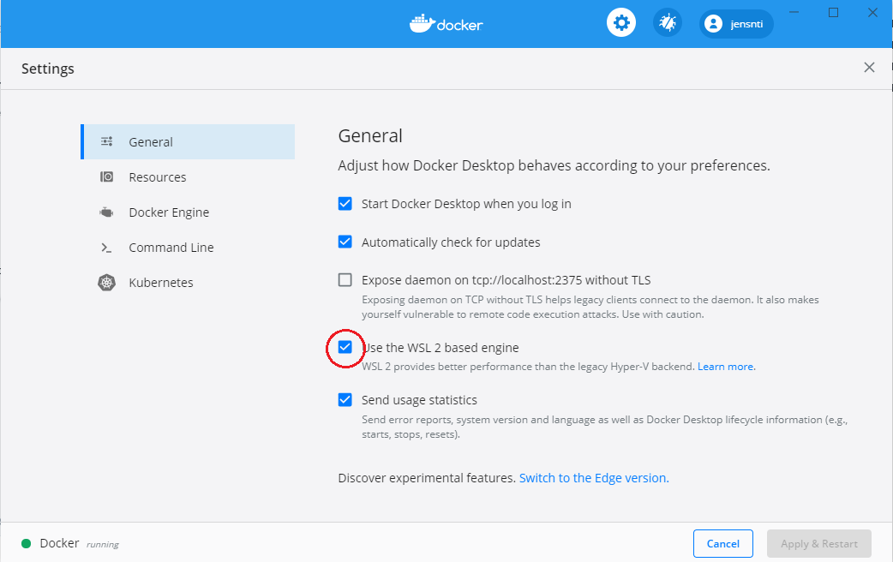
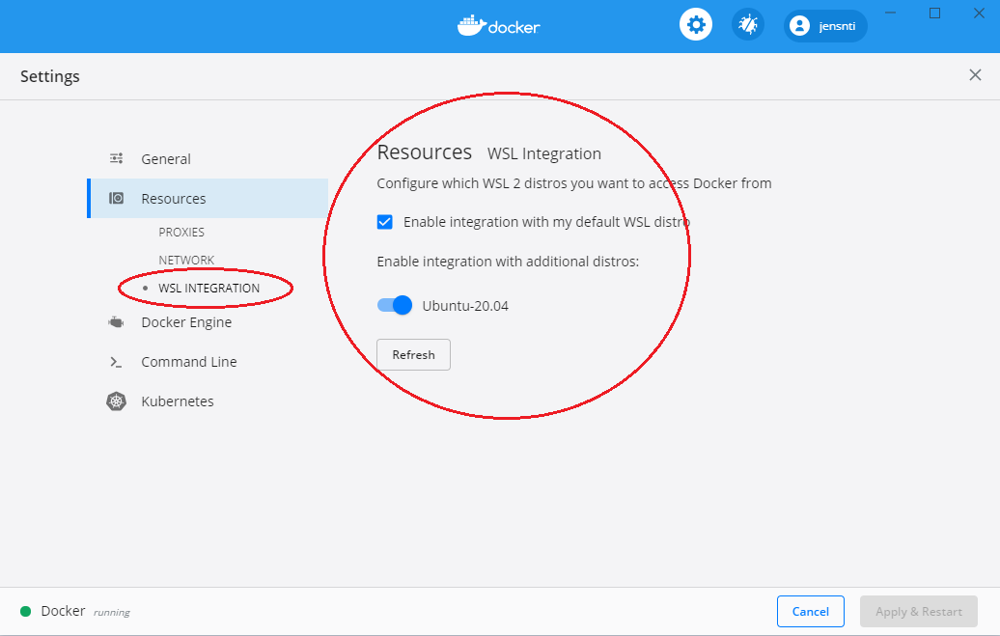

# Docker

## Installation


Detta kräver att du har WSL2 installerat. Kontrollera med att i Powershell köra `wsl -l -v`


* Börja med att installera Windows Subsystem Linux 2, en guide finns [här](https://docs.microsoft.com/en-us/windows/wsl/install-win10).
  * Om du installerar en ny distribution:
    * `sudo apt update`
    * `sudo apt upgrade -y`
* När det är klart, installera [Docker desktop](https://www.docker.com/) för Windows.
* Se till att du har Remote extension för Visual Studio Code, den [här](https://marketplace.visualstudio.com/items?itemName=ms-vscode-remote.remote-wsl).

Nästa steg är att konfigurera Docker så att det använder WSL2, se fig 1 och att det har tillgång till WSL, fig 2.





Du kan eventuellt behöva starta om datorn, WSL och eller Docker efter detta. Men du ska kunna starta WSL och köra kommandot docker. Docker körs då från Windows, men finns tillgängligt från WSL.



```bash
docker
```



 [https://github.com/jensnti/dockerstuff](https://github.com/jensnti/dockerstuff)

