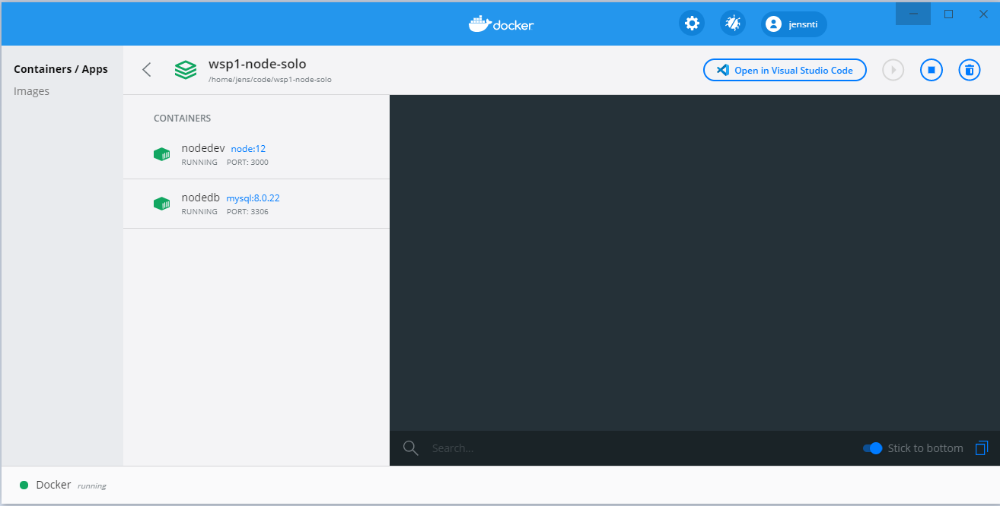
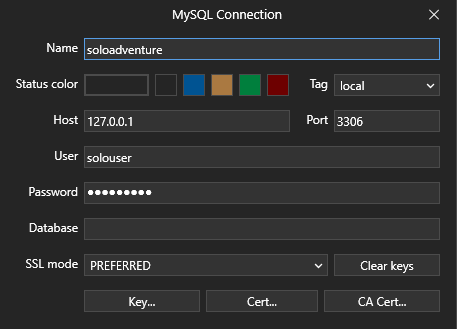
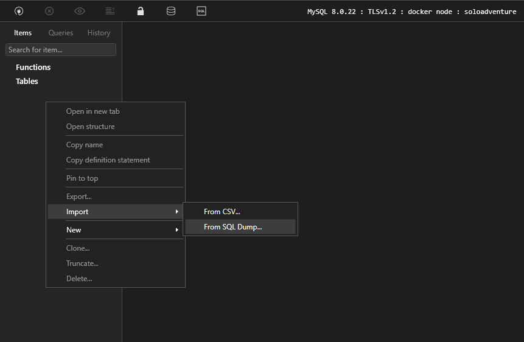

# Docker

## Installation


Detta kräver att du har WSL2 installerat. Du kan kontrollera din version med Powershell, kör `wsl -l -v`


* Installera Windows Subsystem Linux 2, en guide finns [här](https://docs.microsoft.com/en-us/windows/wsl/install-win10).
  * Om du installerar en ny distribution:
    * `sudo apt update`
    * `sudo apt upgrade -y`
* Installera [Docker desktop](https://www.docker.com/) för Windows.
  * Kör igenom Dockers Get started Tutorial i programmet.
* Se till att du har Remote extension för Visual Studio Code, den [här](https://marketplace.visualstudio.com/items?itemName=ms-vscode-remote.remote-wsl).

Nästa steg är att konfigurera Docker så att det använder WSL2, se fig 1 och att det har tillgång till WSL, fig 2.


Du kan eventuellt behöva starta om datorn, WSL och eller Docker efter detta. Men du ska kunna starta WSL och köra kommandot docker. Docker körs då från Windows, men finns tillgängligt från WSL.



```bash
docker
```



## Ett första test med Node

Innan du kommer igång så krävs det att du installerar lite programvara lokalt.

```text
sudo apt install curl dirmngr apt-transport-https lsb-release ca-certificates -y
curl -sL https://deb.nodesource.com/setup_12.x | sudo -E bash -
sudo apt install nodejs -y
sudo npm i -g express express-generator
```

Nästa steg är att skapa ett Express-projekt som kommer utgöra basen för denna container.



```bash
mkdir wsp1-docker-node
cd wsp1-docker-node
express --view pug --css sass --git
npm install
```



För att underlätta utvecklingen används även nodemon.



```bash
npm install --save-dev nodemon
```



Starta sedan Visual Studio Code.



```bash
code -r .
```



Lägg sedan till följande kod så att nodemon körs.


```javascript
  "scripts": {
    "start": "nodemon ./bin/www"
  },
```


### Docker filer

Docker utgår från ett antal konfigurationsfiler för att skapa en image. Denna image är det som körs och används i en Docker container. Skapa följande filer i projektmappen.


```yaml
version: "3"
services:
  node:
    container_name: nodejs
    image: "node:12"
    user: "node"
    working_dir: /var/www
    environment:
      - NODE_ENV=development
    volumes:
      - ./:/var/www
    ports:
    - "3000:3000"
    command: "npm start"
```



```yaml
FROM node:12
WORKDIR /var/www
COPY package*.json ./
RUN npm install
COPY . .
EXPOSE 3000
CMD ["npm", "start"]
```


Om du har skapat Express-projektet, Docker-filerna och allt fungerar så är du redo att skapa en image och testa den.



```bash
docker-compose up -d
```



Vänta på att imagen ska skapas, sedan öppnar du Docker-gränssnittet. Navigera till Containers och prova att öppna projektet i en webbläsare. Om allt fungerar så öppnas ditt Express projekt.


Öppna sedan projektet med Visual Studio Code och prova att redigera projektets index filer. Ladda sedan om sidan i webbläsaren.




```javascript
res.render('index', { title: 'Docker' });
```





```markup
extends layout

block content
  h1= title
  p Welcome to #{title}, this is amazing.

```





Koden för hela exemplet finns [här](https://github.com/jensnti/wsp1-docker-node).


## Praktiskt

Denna instruktion utgår från att du ska klona och köra igång ett repo, i detta fallet Soloäventyret. 



```bash
git clone --single-branch --branch docker https://github.com/jensnti/wsp1-node-solo
```



Docker filerna följer med för detta, vill du klona ditt eget soloäventyr så är det följande filer du behöver. Notera mappen för my.cnf.

* [https://raw.githubusercontent.com/jensnti/wsp1-node-solo/docker/docker-compose.yml](https://raw.githubusercontent.com/jensnti/wsp1-node-solo/docker/docker-compose.yml)
* [https://github.com/jensnti/wsp1-node-solo/blob/docker/Dockerfile](https://github.com/jensnti/wsp1-node-solo/blob/docker/Dockerfile)
* [https://github.com/jensnti/wsp1-node-solo/blob/docker/mysql/my.cnf](https://github.com/jensnti/wsp1-node-solo/blob/docker/mysql/my.cnf)

Filerna kommer att starta 2 containers.

* nodedev
  * Kör node:12.
  * Kör npm start från package.json
  * På port 3000
* nodedb
  * Kör mysql:8
  * Skapar användare och databas.
    * database: soloadventure
    * root password: password123



```bash
cd wsp1-node-solo
npm install
cp .env-example .env
```



Efter att projektet klonats ned och install är kört så behöver det köras lite kommandon för att få allt att fungera. Kör följande kommando för att bygga en image och starta den som en tjänst.



```bash
docker-compose up -d --build
```



Om kommandot fungerar som det ska så startas dina containers, se Fig 3.



Nästa steg blir att slutföra konfigurationen av databasanvändaren och ladda in databasen. För att göra det behöver du koppla upp dig mot databas-containers bash.



```bash
docker-compose exec db bash
```



Väl inne startar du mysql som root. Lösenordet ska vara password123.

```yaml
mysql -u root -p 
```

Användaren till kontot skapades tillsammans med databasen tidigare, men permissions behövs fortfarande sättas och uppdateras för node.



```sql
CREATE USER 'solouser'@'%' IDENTIFIED BY 'password';
GRANT ALL PRIVILEGES ON soloadventure.* TO 'solouser'@'%';
ALTER USER 'solouser'@'%' IDENTIFIED WITH mysql_native_password BY 'password';
FLUSH PRIVILEGES;
```



När detta är gjort så är det sista steget att importera databasen. Detta kan vi göra med tableplus. Skapa en ny uppkoppling, Fig 4.



Välj databas och sedan Import, databas-dumpen finns [här](https://raw.githubusercontent.com/jensnti/wsp1-node-solo/docker/dump.sql). Se Fig 5.



Förhoppningsvis så kan du nu surfa till [localhost ](http://localhost:3000/)och testa äventyret. Om du behöver bygga om din image.



```bash
docker-compose up -d --build
```



## Snabbstart

Filer för att skapa en image med node, npm och databas.

* Skapa ett nytt Express-projekt eller klona ett från Git.
* Skapa följande konfigurationsfiler i mappen.
* Se till att Docker är igång.
* Kör `docker-compose up -d build`
* Du bör nu kunna surfa till [localhost](http://localhost:3000)




```yaml
FROM node:12

# Create app directory
WORKDIR /var/www

# Install app dependencies
# A wildcard is used to ensure both package.json AND package-lock.json are copied
# where available (npm@5+)
COPY package*.json ./

RUN npm install
# If you are building your code for production
# RUN npm ci --only=production

# Add user for application
RUN groupadd -g 1000 www
RUN useradd -u 1000 -ms /bin/bash -g www www

# Bundle app source
COPY . .

# Change current user to www
USER www

EXPOSE 3000

CMD ["npm", "start"]
```





```yaml
version: "3"
services:
  node:
    image: "node:12"
    user: "node"
    working_dir: /var/www
    environment:
      - NODE_ENV=development
    volumes:
      - ./:/var/www
    ports:
    - ${port:-3000}:3000
    # expose:
    #   - "3000"
    command: "npm start"
    networks:
      - node-net

  #MySQL Service
  db:
    image: mysql:8.0.22
    restart: unless-stopped
    tty: true
    command:
      '--character-set-server=utf8mb4'
    ports:
      - "3306:3306"
    environment:
      MYSQL_DATABASE: databasename
      MYSQL_ROOT_PASSWORD: password
      SERVICE_TAGS: dev
      SERVICE_NAME: mysql
    volumes:
      - dbdata:/var/lib/mysql/
      - ./mysql/my.cnf:/etc/mysql/my.cnf
    networks:
      - node-net

#Docker Networks
networks:
  node-net:
    driver: bridge
#Volumes
volumes:
  dbdata:
    driver: local
```





```
node_modules
npm-debug.log
```





```bash
[mysqld]
general_log = 1
general_log_file = /var/lib/mysql/general.log
secure-file-priv = ""

```




För att konfigurera databasen behöver du koppla upp dig till den, skapa användaren och konfigurera rättigheterna.



```sql
CREATE USER 'username'@'%' IDENTIFIED BY 'password';
GRANT ALL PRIVILEGES ON databasename.* TO 'username'@'%';
ALTER USER 'username'@'%' IDENTIFIED WITH mysql_native_password BY 'password';
FLUSH PRIVILEGES;
```



