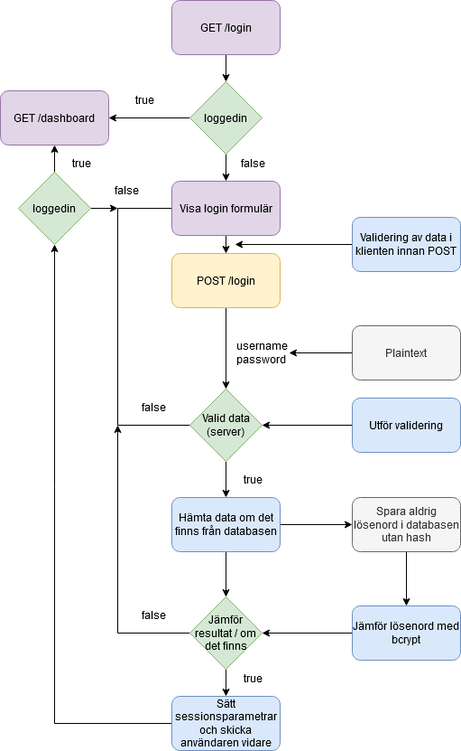

# Inloggning

## Teori

Ett exempel på ett inloggningsförfarande genom webbplats.



Den högra delen är extra information kring säkerhet.

## Praktik

Hur ska vi utföra detta.

Node, express och mysql, se tidigare kapitel.



```bash
mkdir projektnamn
cd projektnamn
express -v pug -c sass --git
npm install
npm install dotenv mysql
npm install nodemon --save-dev
```






```javascript
"start": "nodemon ./bin/www"
```




Du behöver skapa en route för login, med en tillgörande view. Denna view ska visa ett formulär. Ett formulär består av form taggen, denna kräver en metod\(GET eller POST\) samt en action. Form elementets action attribut bestämmer vars formuläret skickar data när det skickas\(submit\).

I form elementet så använder vi olika former av input element för att hantera data från användaren. Här kan en första validering utföras för att öka säkerheten, som typ av fält.



```markup
<form method="post" action="/login">
    <input type="text" name="username">
    <input type="password" name="password">
    <button type="submit">Login</button>
</form>
```



Undersök den data som skickas från ett HTML formulär i webbläsarens utvecklarverktyg. Du hittar denna request under Network fliken.


Ostylade HTML formulär är hemska, så hitta gärna något ramverk du kan använda.


### Tabell för användare

En användartabell behöver inte så mycket för att fungera. I ett mer utökat system så kan vi behöva spara information för email-verifiering och så vidare. Det är god praxis att spara timestamps kopplat till kontot av säkerhetsskäl.

Notera att både användarnamn och email är unika.



```sql
mysql> describe users;
+------------+--------------+------+-----+---------+----------------+
| Field      | Type         | Null | Key | Default | Extra          |
+------------+--------------+------+-----+---------+----------------+
| id         | int unsigned | NO   | PRI | NULL    | auto_increment |
| name       | varchar(50)  | NO   | UNI | NULL    |                |
| password   | varchar(255) | NO   |     | NULL    |                |
| email      | varchar(255) | NO   | UNI | NULL    |                |
| created_at | timestamp    | NO   |     | NULL    |                |
| updated_at | timestamp    | NO   |     | NULL    |                |
+------------+--------------+------+-----+---------+----------------+
```



### Prata med databasen

Sker som tidigare med databasmodellen från tidigare kapitel.



### Ta emot data

Din login route behöver ta emot och hantera en post request från login formuläret. Den data som routen tar emot sparas i req.body.




```javascript
router.post('/', async function(req, res, next) {
  console.log(req.body);
});
```




### Lösenord

Användaren kommer att skicka sitt lösenord i klartext till din server\(ett problem med HTTP som åtgärdats med HTTPS\). Det lösenordet är något som vi aldrig ska spara av säkerhetsskäl.


Spara aldrig lösenord i klartext i databasen.


Det som sparas i databasen ska vara en **hash**, det vill säga en sträng med olika tecken. För att hasha lösenordet används en algoritm som kallas för [bcrypt](https://en.wikipedia.org/wiki/Bcrypt). Bcrypt anses vara säker för detta.

Bcrypt finns som ett node paket.

```text
npm install bcrypt
```

Förfarandet blir sedan att.

1. Ta emot användarens lösenord.
2. Omvandla lösenordet till en hash.
3. Hämta den sparade hashen av lösenordet från databasen.
4. Jämföra de två, om det stämmer loggas användaren in.

Bcrypt paketet använder ett par metoder för det, se [manualen](https://www.npmjs.com/package/bcrypt#usage).

### Kom ihåg att jag är inloggad

För detta så använder du sessions eller kakor.



```bash
npm install express-session
```



Konfigurationsanvisningar finns på paketets sida, [npmjs.org](https://www.npmjs.com/package/express-session). För att sätta en session parameter så används request objeketet i express.



```javascript
req.session.loggedin = true;

if (req.session.loggedin) // inloggad!
```



## Create, read, update, delete

Ett login-system innehåller oftast alla delar av create, read, update, delete\(**CRUD**\). [CRUD ](https://en.wikipedia.org/wiki/Create,_read,_update_and_delete)är en akronym för de vanliga operationerna som utförs när data sparas, i ett login-system blir det.

* Skapa en användare, create.
* Logga in en användare, read.
* Uppdatera en användare, update.
* Ta bort en användare, delete.

### SQL

CRUD kan kopplas till ett antal SQL frågor som utför detta. 



```sql
SELECT password FROM users WHERE name = name;
INSERT INTO users (name, password) VALUES ('namn', 'pass');
UPDATE users SET namn = 'namnet' WHERE id = 1;
DELETE FROM users WHERE id = 1;
```



Alla frågorna kan köras genom databasmodellen vi använt och värden bör används med förberedda frågor, det vill säga använda platshållare ? för värden.


CRUD rör inte bara databas, utan handlar om att spara data på något sätt i en applikation.


## Övningsprojekt

* Skapa ett login system.
* Låt användaren skriva korta bloggar/inlägg/tweets eller vad det nu kan vara.
  * Databasdesignen finns [här](../databas/databasdesign.md).
* Gör så att en användares inlägg visas på deras "hem" sida.
* Andra användare, som är inloggade, ska kunna läsas andras "hem".
* Skapa funktionen för att kommentera på andras inlägg.
  * Bra övning i databasdesign och JOIN i SQL.

## Repo

Kopiera inte slutprodukten, då lär du dig inget, gå igenom de commits som är gjorda för att se vad du har missat och kan behöva.




