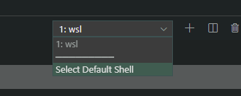

# Windows Subsystem for Linux

> _“The Windows Subsystem for Linux lets developers run GNU/Linux environment -- including most command-line tools, utilities, and applications -- directly on Windows, unmodified, without the overhead of a virtual machine.”   -_    [Microsoft.com](https://docs.microsoft.com/en-us/windows/wsl/install-win10)

Det här dokumentet innehåller ett flertal instruktioner för hur du kommer igång och sätter upp en fungerande utvecklarmiljö med **Windows Subsystem for Linux \(WSL\)** och [**Ubuntu**](https://ubuntu.com/).

Majoriteten av de kommandon som visas kör du i **terminalen**, genom ett **skal** \(engelska **shell\)**. Det är därför väldigt viktigt att du följer instruktionerna noggrant och att du får kommandona att fungera innan du går vidare. Jag kan inte skriva eller säga det nog många gånger och det är:


Läs vad som sker på din skärm! Nästan alla kommandon ger felmeddelanden när det inte fungerar. Många kommandon ger inte något meddelande alls när de fungerade.


För att få ut det mesta ur detta dokument och förstå så är det självklart bra om du har en grundläggande kunskap om hur du använder terminalen; **Bash** eller **Powershell**. I slutet av dokumentet finns det en samlad lista över användbara [kommandon](wsl.md#bash).

## Installation

Windows kräver att du slår på en feature för att kunna installera WSL. Starta Powershell som administratör och kör följande kommando.



```text
Enable-WindowsOptionalFeature -Online -FeatureName Microsoft-Windows-Subsystem-Linux
```



Windows kommer att be dig starta om datorn när kommandot är utfört. När din dator startat om så startar du sedan **Microsoft Store** och söker efter **Ubuntu**.

Välj senaste versionen av Ubuntu LTS och installera. 


Skriv in ett användarnamn under installationen när den frågar.   
****Välj ett lösenord som du kommer ihåg!


När installationen är färdig så startar du Ubuntu och kör följande kommandon med **apt**, apt är Ubuntus pakethanterare. Först uppdaterar apt Ubuntus listor över paket. Sedan uppgraderar apt de paket som behöver uppdateras.



```bash
sudo apt update
sudo apt upgrade
```




Kommandot **sudo** låter dig köra program med rättigheterna för superuser, Linux root konto. Det behövs ofta när du ska installera program. Försök undvika det om möjligt av säkerhetsskäl.


Ubuntu körs nu i ett fönster under Windows och ger dig tillgång till ett flertal program som används vid webbutveckling. Det utan att behöva [virtualisera](https://en.wikipedia.org/wiki/Virtualization) eller [dual-boota](https://en.wikipedia.org/wiki/Multi-booting) Linux. 

För att komma åt andra **diskar** eller **partitioner** med Windows filer på när du kör Ubuntu så hittar du dem i /mnt.



```bash
cd /mnt
ls -la
```



List kommandot visar de **filsystem** som är aktiva under Linux. Kör du en skoldator med en disk så kommer du med största sannolikhet se`c`, vilket är disken som är`c:` under Windows.

## Visual Studio Code

Innan du fortsätter behöver du installera **Visual Studio Code** \(förkortat till **vscode**\). Hämta vscode [här](https://code.visualstudio.com/). 

Vscode är en **integrerad utvecklingsmiljö** \(på engelska **Integrated Development Environment, IDE**\). Ett program som innehåller flera verktyg för att koda.

I vscode är inte WSL dess standard shell. För att byta shell i vscode behöver du ändra inställningarna.


**I menyn -&gt; Terminal -&gt; New Terminal**


Vscode kommer att öppna ett nytt terminalfönster, för att välja default shell klickar du som på bilden och väljer sedan WSL.



Nästa steg är att skapa goda förutsättningar för att arbeta med kod i vscode. Börja med att skapa en **mapp** i c: med namnet code \(om du inte har en sedan tidigare\). Skapandet av mappen gör du i Windows. 


Att samla kod på ett ställe är både praktiskt och bra praxis.


För att enkelt komma åt code-mappen ska du skapa en [**symbolisk länk**](https://sv.wikipedia.org/wiki/Symbolisk_l%C3%A4nk) **\(symlink\)** till den. Navigera till **hem-mappen** i WSL/Ubuntu och skapa länken såhär:



```bash
cd
ln -s /mnt/c/code
ls -la
```



List kommandot visar om symlinken skapats. Är den röd saknas källan och det har blivit fel. Du kan se hur det ser ut här nedanför.

```bash
lrwxrwxrwx 1 jens jens       11 Feb 17  2019 code -> /mnt/c/code
```

Öppna code-mappen och lista innehållet.



```bash
cd code
ls -la
```



## GitHub

För att använda **GIT** med WSL behöder det installeras. 



```bash
sudo apt install git
```



Git kan nu användas från WSL. När du gör din första **commit** kommer Git efterfråga dina användaruppgifter. Användaruppgifterna anger du med följande kommandon.


Många program i Linux-miljö ger inget meddelande när de lyckas. 




```bash
git config --global user.email "you@example.com"
git config --global user.name "Your Name"
```



Gits terminal-kommandon finns i detta [Cheat Sheet](https://github.github.com/training-kit/downloads/github-git-cheat-sheet.pdf).

## LAMP server

I webbserver-kursen kommer du att få prova på ett antal olika typer av **webbservrar**. [**LAMP** ](https://en.wikipedia.org/wiki/LAMP_%28software_bundle%29)är en akronym för en typ av server och betyder en webbserver med [**Linux**](https://www.linux.org/), [**Apache**](https://www.apache.org/), [**MySQL**](https://www.mysql.com/) och [**PHP**](https://www.php.net/). Det finns flera varianter av **\*AMP** där första bokstaven byts ut beroende på vilket operativsystem du använder, till exempel **WAMP** och **MAMP**. Eftersom du kör en Linux distribution, Ubuntu, under Windows så installerar du en LAMP-server.

Ubuntu har en färdig samling paket för LAMP-server.



```bash
sudo apt install lamp-server^
```



Svara \[Y\] på frågorna och vänta på att den ska ladda ner och installera paketen. Förhoppningsvis så går det bra, strular det så prova att starta om installationen.

### Apache

Apache är ett open source webbserver-projekt som har funnits sedan 1995. Apache är den absolut vanligast förekommande webbservern på internet. I en LAMP-server så är alltså Apache själva webbservern.

Apache startas på Ubuntu som en **service.**



```bash
sudo service apache2 restart
```




När en service startar och fungerar så står det \[OK\] till höger i terminalen. Eventuella meddelande är varningar eller annat. Så länge det står \[OK\] så är tjänsten startad.  
Annars står det \[FAIL\].


Fungerade det att starta din service, \[OK\], så kan du nu öppna en webbläsare och surfa till [http://localhost](http://localhost).


\*\*\*\*[**localhost**](https://en.wikipedia.org/wiki/Localhost) ****är ett alias för din dators loopback interface som har ip-adressen 127.0.0.1.


Om det står ett felmeddelande, \[FAIL\], så behöver det felsökas. Det vanligaste felet när du försöker starta Apache är att **port 80** är blockerad. 


En port är en adress som trafiken skickas till. En webbservers standardport är 80.


Windows använder ofta port 80 för olika tjänster. Du kan undersöka det med hjälp av Powershell.



```bash
netstat -aon | findstr :80
```



Det finns två sätt att åtgärda problemet med att Windows använder port 80. Antingen avslutar du och stänger av tjänsterna som blockerar port 80, eller så ändrar du vilken port Apache ska använda. Det enklare sättet är att konfigurera om vilken port Apache använder.



```bash
cd /etc/apache2
sudo nano ports.conf
```



Med textredigeringsprogrammet **Nano** ändra raden där det står `Listen 80` till `Listen 88`. Spara sedan filen i Nano genom att trycka `ctrl+o`, följt av enter och sedan `ctrl+x` för att avsluta.

Apache behöver sedan starts om. Om Apache startar och du ser \[OK\] så surfa till  [http://localhost:88](http://localhost:88) med webbläsaren. Webbservern använder nu **port 88** och du måste ange det med `:88` efter adressen.


Apache-logfiler för felsökning finns under /var/log/apache2.


### MySQL

MySQL är en **databashanterare** som använder språket **Structured Query Language \(SQL\)**. Precis som Apache är MySQL ett open source-projekt som började 1995. MySQL är den **databasserver** som används i LAMP.

På Ubuntu startas **MySQL-server** som en service.



```bash
sudo service mysql restart
```



MySQL-servern ligger nu i bakgrunden och väntar på att användas. MySQL använder **port 3306** som standard och det behöver inte ändras.

En MySQL-server används genom någon form av **klient**. Klienten kan vara ett program, en webbtjänst eller annat. För att koppla upp en klient till en MySQL-server behövs det en användare och ett lösenord. Första gången du gör detta så använder du sudo och en lokal MySQL-klient.



```bash
sudo mysql -u root
```



Sudo används här för att skapa en uppkoppling till MySQL-servern från MySQL-klienten med användaren root \(-u root\). Om uppkopplingen till MySQL-servern fungerade så kör följande kommando för att skapa dig en användare. Byt ut `username` och `password` mot dina egna uppgifter.


Skriv ett lösenord som du kommer ihåg och inget “viktigt” lösenord.




```sql
CREATE USER 'username'@'localhost' IDENTIFIED BY 'password';
GRANT ALL PRIVILEGES ON *.* TO 'username'@'localhost';
```



Kommandot skapa en användare för alla databaser på localhost med username och password. För att avsluta skriver du exit.

Använd sedan MySQL-klienten för att testa användaren.



```bash
mysql -u username -p
```



Väl inne på servern så skrivs kommandon med [SQL](../databas/sql.md).


MySQL-logfiler för felsökning finns under /var/log/mysql.


### phpMyAdmin

Från MySQL-klienten används SQL för att styra databasen och köra kommandon. Det är viktigt att du lär dig grunderna i SQL. Men för att förenkla arbetet med MySQL-servern finns det en klient som heter **phpMyAdmin**. phpMyAdmin kan installeras med apt.



```bash
sudo apt install phpmyadmin
```



Välj följande vid installationen:

1. apache2 server.
2. Database common.
3. config, generate password.

Apache2 använder ett modulärt system för konfiguration. För att slutföra installationen av phpMyAdmin måste vi skapa en symlink till konfigurationsfilen och berätta för systemet att den ska användas.



```bash
cd /etc/apache2/sites-available
sudo ln -s /etc/phpmyadmin/apache.conf phpmyadmin.conf
ls -la
```



Kommandot skapar en symlink som heter phpmyadmin.conf och som pekar till källfilen. Du kan se hur det ser ut här nedanför.

```bash
lrwxrwxrwx 1 root root   27 Feb 17  2019 phpmyadmin.conf -> /etc/phpmyadmin/apache.conf
```

Nästa steg är att aktivera konfigurationen med kommandot `a2ensite`.



```bash
sudo a2ensite phpmyadmin
```



Starta sedan om Apache och surfa till [http://localhost/phpmyadmin](http://localhost/phpmyadmin) eller [http://localhost:88/phpmyadmin](http://localhost:88/phpmyadmin) beroende på webbserverns port.

### Userdir

Linux sparar alla användares data i `/home`, det är din hem-mapp. För att förenkla arbetet med filer till webbservern används en **modul** till Apache som heter **userdir**. Userdir kopplar en mapp, **public\_html**, i hem-mappen till webbservern. 



```bash
sudo a2enmod userdir
sudo service apache2 restart
```



Skapa sedan mappen public\_html i hem-mappen.



```bash
cd
mkdir public_html
```



Surfa sedan till http://localhost/~USER eller http://localhost:88/~USER, där USER är ett Linux username.

### PHP

**PHP: Hypertext Preprocessor \(PHP\)** är ett skriptspråk för webbservrar som används för att skapa **dynamiskt innehåll**. Det fungerar så att PHP kod tolkas och omvandlas till text. Apache behöver konfigureras för att tillåta PHP i public\_html. För att göra det behöver modulens konfigurationsfil redigeras.



```bash
cd /etc/apache2/mods-available
ls -la php*
sudo nano phpX.X.conf # där X är versionsnumret
```



Kommentera ut följande rader med `#`.


```bash
<IfModule mod_userdir.c>
    <Directory /home/*/public_html>
        php_admin_value engine Off
    </Directory>
</IfModule>
```


Apache behöver sedan startas om.

Skapa sedan en ny fil i public\_html för att testa om PHP fungerar.



```bash
cd
cd public_html
echo "<?php phpinfo(); ?>" > info.php
```



Surfa sedan till localhost/~USER/info.php med webbläsaren. Fungerar det så ser presenteras information för webbservern. När PHP inte fungerar så skrivs koden ut på det sätt den skrivs, det sker alltså ingen tolkning av Apache.


```php
<?php phpinfo(); ?>
```


## Node.js

**Node** är en annan webbserver. Node har ett eget avsnitt i denna guide,  [Node och Express](../node/node-och-express/)

## Resultat

Du har nu installerat och skapat en grym utvecklingsmiljö där du kan utföra ditt utvecklingsarbete. Du slipper krångliga Windows-lösningar som XAMPP och kan köra programmen under WSL vilket ger mycket större kontroll.

Miljön använder ett shell i Linux vilket är standarden inom det här området och otroligt viktigt att behärska.

## Bash

Att kunna navigera i bash är en förutsättning för användningen av WSL. Här är några av de kommandon som du bör lära dig. De flesta kommandon i linux ger dig bra hjälp om du skriver.



```bash
kommando --help
```



<table>
  <thead>
    <tr>
      <th style="text-align:left">Kommando</th>
      <th style="text-align:left">F&#xF6;rklaring</th>
    </tr>
  </thead>
  <tbody>
    <tr>
      <td style="text-align:left">sudo</td>
      <td style="text-align:left">sudo kommando, anv&#xE4;nds n&#xE4;r du beh&#xF6;ver k&#xF6;ra n&#xE5;got
        som superuser</td>
    </tr>
    <tr>
      <td style="text-align:left">ls -la</td>
      <td style="text-align:left">list, visa alla filer och mappar i nuvarande mapp</td>
    </tr>
    <tr>
      <td style="text-align:left">cd</td>
      <td style="text-align:left">
        <p>change directory, byt mapp till den du skriver efter kommandot.</p>
        <p>Skriver du enbart cd kommer du till din hem mapp /home/username</p>
      </td>
    </tr>
    <tr>
      <td style="text-align:left">mkdir</td>
      <td style="text-align:left">mkdir namn, skapa en ny mapp med namn</td>
    </tr>
    <tr>
      <td style="text-align:left">rm -rf</td>
      <td style="text-align:left">remove, -rf f&#xF6;r att ta bort mappar, f&#xF6;ljt av filnamn</td>
    </tr>
    <tr>
      <td style="text-align:left">cp</td>
      <td style="text-align:left">copy, kopiera fil A till B</td>
    </tr>
    <tr>
      <td style="text-align:left">mv</td>
      <td style="text-align:left">move, flytta fil A till B</td>
    </tr>
    <tr>
      <td style="text-align:left">nano</td>
      <td style="text-align:left">nano &#xE4;r ett textredigeringsprogram</td>
    </tr>
    <tr>
      <td style="text-align:left">cat</td>
      <td style="text-align:left">cat filnamn, f&#xF6;r att skriva ut en fil i terminalen</td>
    </tr>
    <tr>
      <td style="text-align:left">history</td>
      <td style="text-align:left">
        <p>history ger dig en lista &#xF6;ver vilka tidigare kommadon du k&#xF6;rt.</p>
        <p>Du kan upprepa kommandon fr&#xE5;n historia med !##, d&#xE4;r ## &#xE4;r
          siffran</p>
      </td>
    </tr>
    <tr>
      <td style="text-align:left">apt</td>
      <td style="text-align:left">
        <p>apt &#xE4;r Ubuntus pakethanterare som du anv&#xE4;nder f&#xF6;r att installera
          program.</p>
        <p>apt update, apt upgrade, apt install</p>
      </td>
    </tr>
    <tr>
      <td style="text-align:left">man</td>
      <td style="text-align:left">man kommando, ger dig manualen f&#xF6;r det kommando du namnger</td>
    </tr>
    <tr>
      <td style="text-align:left">ln -s</td>
      <td style="text-align:left">link -s f&#xF6;r att skapa en symbolisk l&#xE4;nk, fr&#xE5;n fil A till
        B</td>
    </tr>
    <tr>
      <td style="text-align:left">ifconfig</td>
      <td style="text-align:left">konfigurera n&#xE4;tverks gr&#xE4;nssnitt, skriv f&#xF6;r att se nuvarande
        konfiguration</td>
    </tr>
  </tbody>
</table>

Listan är lång, läs mer [här](https://www.howtoforge.com/linux-commands/).

##     

